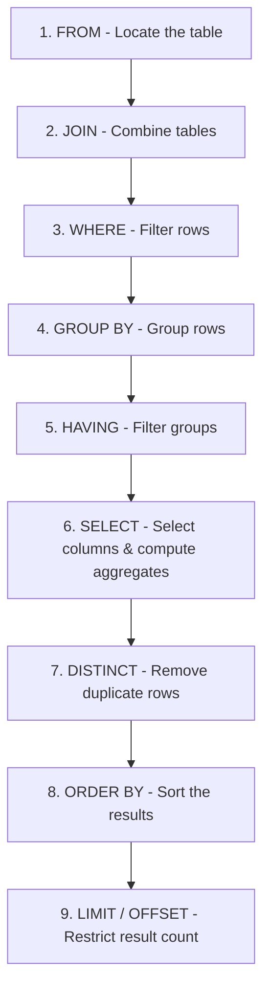

In real-world applications, you often need to analyze trends and generate summary reports rather than retrieving individual rows. For instance, instead of viewing every employee's salary, you might want to know the total payroll per department, the average salary of engineers, or find which departments have more than five employees.

In this fifth episode of our Database series, we will cover SQL data aggregation using the **`GROUP BY`** and **`HAVING`** clauses in PostgreSQL. We will build directly on top of the aggregate functions we covered in the previous guide.

---

## 1. Setup: Sample Data

We will continue using our core `employee` table schema. Let's ensure it is populated with the following records:

```sql
CREATE TABLE employee (
    emp_id INT,
    emp_name VARCHAR(100),
    emp_salary DECIMAL,
    emp_department VARCHAR(100)
);

INSERT INTO employee (emp_id, emp_name, emp_salary, emp_department) 
VALUES 
  (1, 'AMAN', 100000.00, 'SALES'),
  (2, 'PRIYA', 120000.00, 'ENGINEERING'),
  (3, 'VIKRAM', 95000.00, 'MARKETING'),
  (4, 'NEHA', 80000.00, 'SALES'),
  (5, 'KABIR', 120000.00, 'ENGINEERING'),
  (6, 'RAM', 85000.00, 'MARKETING'),
  (7, 'SARA', 95000.00, 'SALES');
```

---

## 2. Recap: Aggregate Functions

As detailed in our [PostgreSQL Aggregate Functions guide](file:///Users/mrityunjaykumar/projects/nextjs/src/content/database/postgresql-aggregate-functions.md), aggregate functions compute summary metrics over multiple rows:
* **`COUNT(*)`**: Total number of rows.
* **`SUM(column)`**: Sum of non-null values.
* **`AVG(column)`**: Average of non-null values.
* **`MIN(column)`** / **`MAX(column)`**: Lowest and highest values.

By default, these functions summarize the *entire* table. To calculate these metrics for individual categories or departments, we use the `GROUP BY` clause.

---

## 3. The GROUP BY Clause

The `GROUP BY` clause divides the rows of a table into smaller groups based on identical values in one or more columns. Once grouped, aggregate functions are applied to each group individually rather than the entire table.

### A. Grouping by a Single Column
Let's find the total salary expense (payroll) and employee count for each department:

```sql
SELECT emp_department, 
       COUNT(*) AS employee_count, 
       SUM(emp_salary) AS total_department_payroll
FROM employee
GROUP BY emp_department;
```

**Output:**
| emp_department | employee_count | total_department_payroll |
|---|---|---|
| SALES | 3 | 275000.00 |
| ENGINEERING | 2 | 240000.00 |
| MARKETING | 2 | 180000.00 |

### B. Common Trap: The Single-Value Rule
A common beginner error is trying to select a non-aggregated column that is not part of the `GROUP BY` clause:

```sql
-- ❌ THIS WILL FAIL IN POSTGRESQL!
SELECT emp_department, emp_name, AVG(emp_salary)
FROM employee
GROUP BY emp_department;
```
> **Why it fails**: PostgreSQL will throw an error: `column "employee.emp_name" must appear in the GROUP BY clause or be used in an aggregate function`. 
> Since there are multiple employee names in a single department, PostgreSQL does not know which name to display next to the single average salary value of that department.

**Rule of Thumb**: Every column in your `SELECT` list must either:
1. Appear inside an aggregate function (e.g., `AVG(emp_salary)`), OR
2. Be explicitly listed in the `GROUP BY` clause.

---

## 4. The HAVING Clause (Filtering Groups)

What if we want to filter our results? If we want to show departments that have a total payroll exceeding `200,000.00`, your first instinct might be to use `WHERE`:

```sql
-- ❌ THIS WILL FAIL!
SELECT emp_department, SUM(emp_salary)
FROM employee
WHERE SUM(emp_salary) > 200000.00
GROUP BY emp_department;
```
> **Why it fails**: PostgreSQL will throw an error: `aggregate functions are not allowed in WHERE`. 
> The `WHERE` clause filters individual rows *before* the database groups them. At the stage when `WHERE` is executed, the sum of salaries does not exist yet.

To filter grouped records based on aggregate values, we must use the **`HAVING`** clause:

```sql
--  THIS WORKS!
SELECT emp_department, SUM(emp_salary) AS total_payroll
FROM employee
GROUP BY emp_department
HAVING SUM(emp_salary) > 200000.00;
```

**Output:**
| emp_department | total_payroll |
|---|---|
| SALES | 275000.00 |
| ENGINEERING | 240000.00 |

---

## 5. WHERE vs. HAVING

It is essential to understand when to use `WHERE` versus `HAVING`.

| Feature | WHERE | HAVING |
|---|---|---|
| **Purpose** | Filters individual rows before grouping | Filters entire groups after grouping |
| **Aggregate Functions** | Cannot use aggregate functions (e.g. `SUM`, `AVG`) | Can use aggregate functions |
| **Execution Order** | Executes before `GROUP BY` | Executes after `GROUP BY` |
| **Applies To** | Individual rows | Grouped summaries |

### Combining WHERE and HAVING in a Single Query
You can use both clauses in the same query. PostgreSQL will first filter rows using `WHERE`, then group them using `GROUP BY`, and finally filter the grouped results using `HAVING`.

Let's find departments whose average salary is greater than `90,000.00`, but *exclude* the employee named `RAM` from the calculations:

```sql
SELECT emp_department, AVG(emp_salary) AS avg_salary
FROM employee
WHERE emp_name != 'RAM' -- 1. Filter out RAM first
GROUP BY emp_department -- 2. Group the remaining rows
HAVING AVG(emp_salary) > 90000.00; -- 3. Filter groups by avg salary
```

---

## 6. SQL Query Execution Order

To write efficient SQL queries, it is useful to know the order in which the database engine processes each clause. Even though you write `SELECT` first, the database executes it much later:



By understanding this sequence, you can predict exactly how your query will run, identify syntax errors immediately, and write high-performing queries in PostgreSQL.
